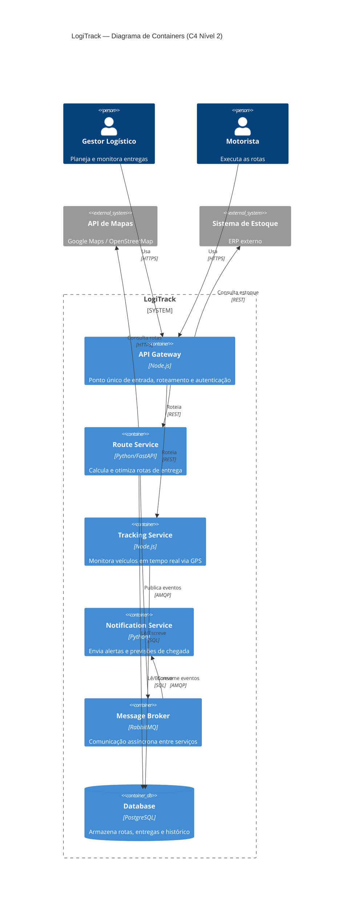

# LogiTrack - Sistema de Otimização de Rotas e Entregas

> Sistema distribuído para otimização inteligente de rotas, monitoramento de veículos em tempo real e previsão de entregas.

## Visão Executiva

O **LogiTrack** moderniza operações logísticas por meio de microsserviços em nuvem, geolocalização em tempo real e comunicação assíncrona. O sistema resolve problemas críticos de atraso, rotas ineficientes e falta de rastreabilidade, atendendo gestores logísticos e motoristas. Na Fase 3, a arquitetura evolui para cloud com escalabilidade horizontal, Circuit Breaker e API Gateway.

## Diagrama C4 - Containers



## ADRs — Decisões Arquiteturais

| ADR | Título | Status |
|-----|--------|--------|
| [ADR 0001](docs/adrs/0001-estrategia-nuvem.md) | Estratégia de Nuvem e Escalabilidade | Aceito |
| [ADR 0002](docs/adrs/0002-padrao-resiliencia.md) | Padrões de Resiliência | Aceito |
| [ADR 0003](docs/adrs/0003-modelo-comunicacao.md) | Modelo de Comunicação | Aceito |

## SAD — Documento de Arquitetura

O documento completo está em [docs/sad/sad-fase3.md](docs/sad/sad-fase3.md).

## Como Executar Localmente

### Pré-requisitos
- Docker e Docker Compose instalados
- Node.js 18+
- Python 3.11+

### Passos

```bash
# Clone o repositório
git clone https://github.com/CamillyFloriano/arquiteutra_logitrack.git
cd arquiteutra_logitrack

# Suba os serviços
docker-compose up -d

# Acesse a API Gateway
http://localhost:8080
```

## Tecnologias

- **API Gateway:** Node.js
- **Microsserviços:** Python/FastAPI, Node.js
- **Mensageria:** RabbitMQ
- **Banco de Dados:** PostgreSQL
- **Cloud:** AWS (ECS + RDS + SQS)
- **Resiliência:** Circuit Breaker (Resilience4j)

## Referências

- Pressman, R. S. (2021). *Engenharia de Software*. McGraw Hill.
- Richards, M., & Ford, N. (2020). *Fundamentals of Software Architecture*. O'Reilly.
- C4 Model: https://c4model.com
- ADR GitHub: https://adr.github.io
