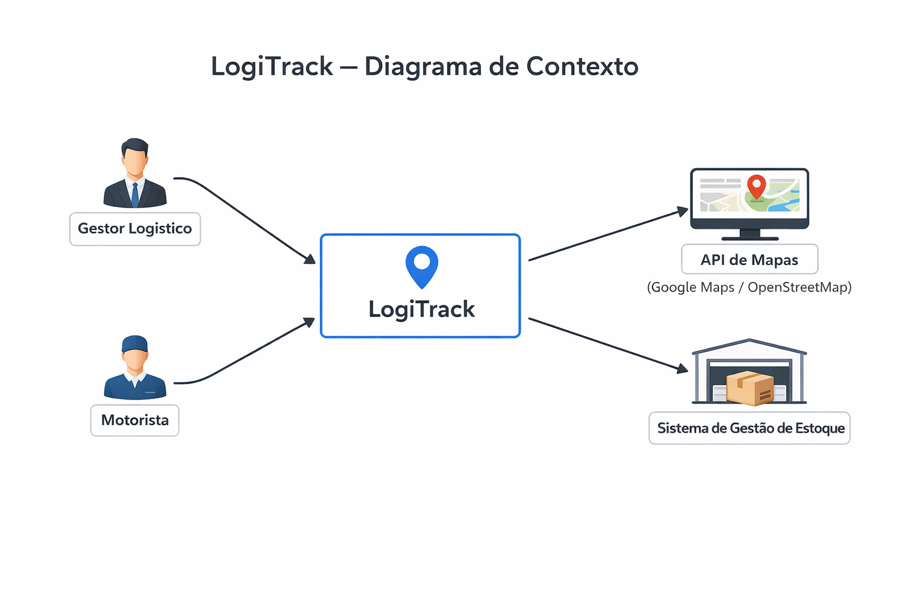
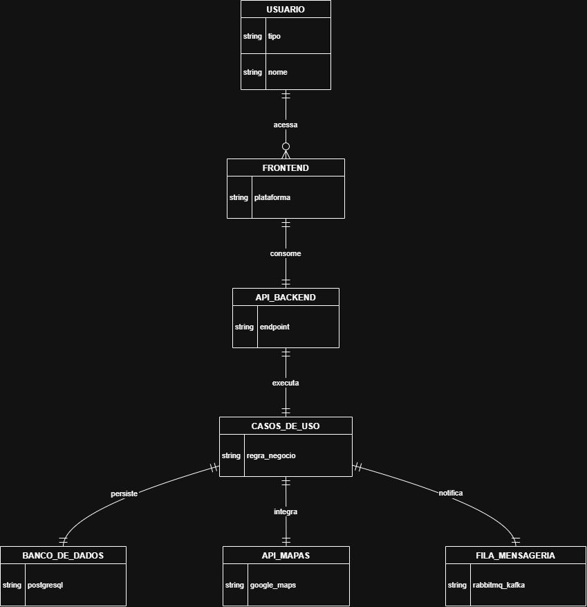

# Documento de Aruitetura de Software (SAD) 
## Sistema para LogiTrack - Sistema de Otimização de Rotas e Entregas

---

# CICLO 1: Visão e Requisitos (Fase 1)

## 1.1 Resumo do Cenário de Negócio
O sistema LogiTrack tem como objetivo modernizar a operação de uma empresa de logística por meio da otimização inteligênte de rotas de entrega. 
Atualmente, muitas empresas enfrentam problemas como atraso, rotas ineficientes e falta de monitoramento em tempo real. O sistema utilizará 
geolocalização para calcular rotas mais eficientes, monitorar veículos em tempo real e fornecer previsões de chegada. Os principais usuários do 
sistema são gestores logísticos e motoristas, que utilizarão a plataforma para planejar e acompanhar entregas.

---

## 1.2 Atributos de Qualidade (RNFs) Priorizados

**1. Desmpenho:**
O sistema precisa calcular rotas e processar dados de localização rapidamente para garantir resposta em tempo real.

**2. Escalabilidade:**
O sistema deve suportar aumento no número de veículos, entregas e usuários sem comprometer o desempenho.

**3. Confiabilidade:**
As informações sobre rotas e entregas precisam ser precisas e consistentes para evitar erros logísticos.

**4. Resiliência:**
O sistema deve continuar funcionando mesmo diate de falhas em serviços externos ou problemas de comunicação.

**5. Disponibilidade:**
O sistema precisa estar acessível durante roda a operação logística para garantir o acompanhamento das entregas.

---

## 1.3 Diagrama de Contexto (C4 Nível 1)

O sistema LogiTrack interage com gestores logísticos, motoriatas e sistemas externos como APIs de mapas e sistemas de estoque.

## 1.4 Classificação da Estratégia

**Classificacao:** Balanceada.

**Justificativa:** A estratégia balanceada busca equilibrar inovação tecnológica e estabilidade. O sistema utiliza tecnologias modernas
para otimização de rotas e processamento de dados em tempo real, mas também se apoia em soluções consolidadas para garantir confiabilidade
e manutenção do sistema, reduzindo riscos no desenvolvimento.

---

# CICLO 2: Blueprint e Decisões (Fase 2)

## 2.1 Diagrama de Containers (C4 Nível 2)

---

## 2.2 Estilo Arquitetural Escolhido

O sistema LogiTrack adota uma arquitetura baseada em Clean Architecture combinada com o padrão Hexagonal (Ports and Adapters).

Essa escolha foi feita para garantir o isolamento da lógica de negócio em relação às dependências externas, como banco de dados e APIs de geolocalização.

Trade-offs:

1. Vantagem (Manutenibilidade): A separação entre domínio e infraestrutura facilita a manutenção e evolução do sistema sem impactar regras de negócio.

2. Vantagem (Testabilidade): A arquitetura permite a utilização de mocks e testes isolados, aumentando a confiabilidade do sistema.

3. Desvantagem (Complexidade): A estrutura exige maior organização e conhecimento técnico da equipe, aumentando a complexidade inicial do desenvolvimento.

4. Desvantagem (Custo inicial): Pode demandar mais tempo de implementação no início em comparação a arquiteturas mais simples como N-Tier.

Essa abordagem atende aos requisitos não funcionais de escalabilidade, confiabilidade e resiliência definidos na Fase 1.

---

## 2.3 Architecture Decision Record (ADR) Principal

Título: Adoção da Arquitetura Hexagonal para isolamento do domínio

Status: Aceita

Contexto:
Na Fase 1, foi identificado que a arquitetura poderia evoluir para um modelo N-Tier tradicional, o que causaria acoplamento entre a camada de negócio e a infraestrutura, como banco de dados e APIs externas de geolocalização. Isso comprometeria a testabilidade, manutenibilidade e escalabilidade do sistema LogiTrack, especialmente considerando o alto volume de requisições e dependência de serviços externos.

Decisão:
Foi adotada a arquitetura Hexagonal (Ports and Adapters), onde o núcleo do sistema (domínio e casos de uso) é isolado de detalhes externos. A comunicação com sistemas externos, como APIs de mapas e banco de dados, ocorre por meio de portas (interfaces) e adaptadores implementados na camada de infraestrutura.

Justificativa:
Essa decisão permite que o domínio permaneça independente de frameworks e tecnologias externas, seguindo os princípios da Clean Architecture (MARTIN, 2017). Além disso, melhora a testabilidade do sistema, pois possibilita o uso de mocks nas integrações externas. Em termos de trade-offs, a arquitetura aumenta a complexidade inicial do sistema, porém oferece maior flexibilidade, escalabilidade e resiliência, atendendo aos requisitos não funcionais definidos, como desempenho e confiabilidade. Conforme Pressman (2011), a adoção de uma arquitetura bem estruturada reduz significativamente a dívida técnica ao longo do ciclo de vida do software.

---

# CICLO 3: Cloud e Resiliência (Fase 3)

## 3.1 Estratégia de Cloud e Implantação

---

## 3.2 Análise de Fragilidade e Mitigação

---

## 3.3 Parecer Técnico Final
